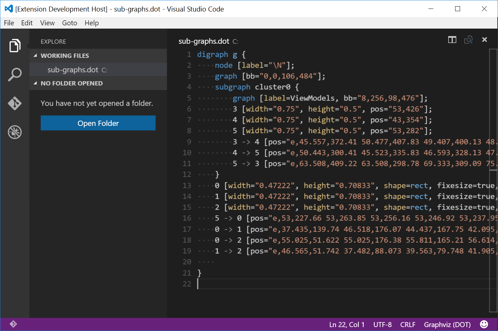

# vscode-graphviz
This extension provides GraphViz (dot) language support for [VS Code](https://code.visualstudio.com/).

# Functionality
- Syntax Highlighting
- Snippets
    - `graph` Graph Template
    - `>` Convert > to ->
    - `var` New Variable
    - `var` New variable [plaintext]
    - `prop` Property [dir=both…]
    - `prop` Property [shape=box]
    - `prop` Property [styles…]
    - `path` Path from -> to [label]
    - `path` Path from -> {to list}
    - `rank` { rank=same|min|max; x; y }

# Install

Open up VS Code and hit `F1` and type `ext` select `install` and type `dot` hit enter and reload window to enable.

# Attribution

"GraphvizLogo" by Source. Licensed under Fair use via [Wikipedia](https://en.wikipedia.org/wiki/File:GraphvizLogo.png#/media/File:GraphvizLogo.png)